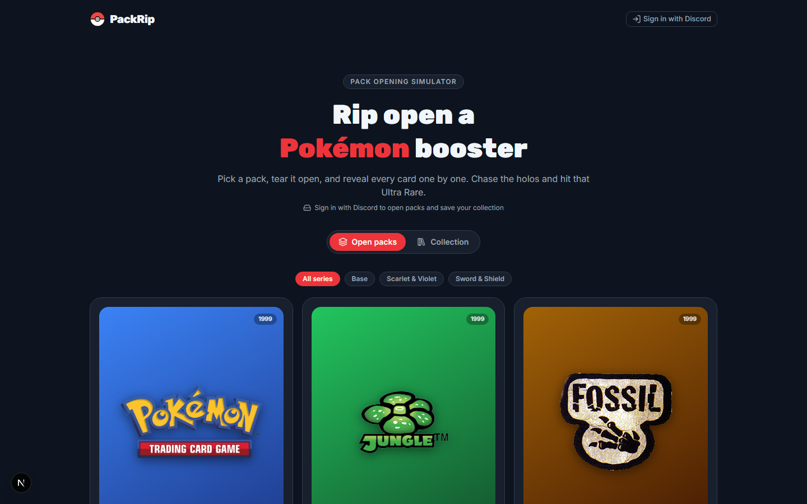
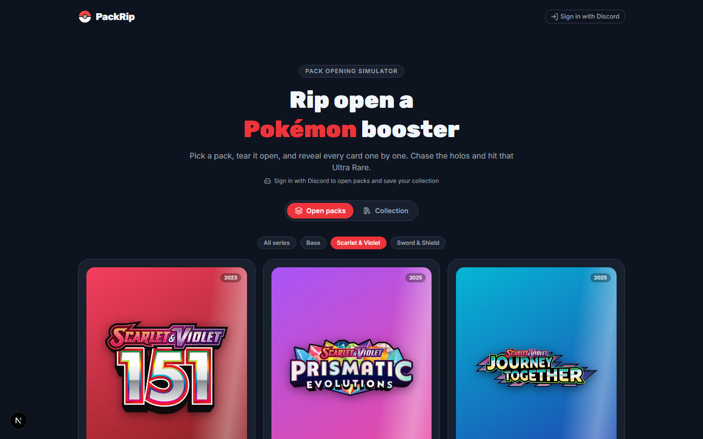
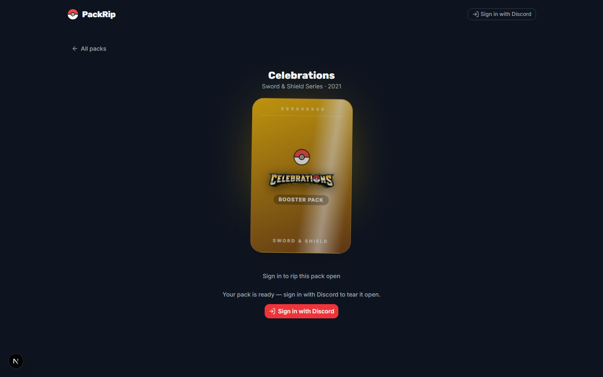
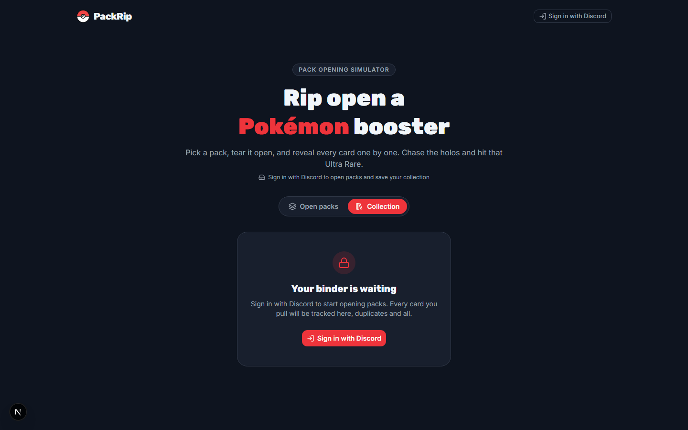

# PackRip

**Rip open Pokémon booster packs — no scissors required.**

PackRip is a free pack-opening simulator built for collectors and nostalgia hunters. Pick a set, tear open a digital booster, flip your cards one by one, and build a binder that tracks every pull. From 1999 Base Set to the latest Scarlet & Violet expansions — the chase is always on.



---

## Why you'll love it

- **The full rip experience** — Sealed pack → tear it open → flip cards one at a time. Confetti when you hit something special.
- **Real sets, real cards** — Curated catalogue spanning Base, Sword & Shield, and Scarlet & Violet, powered by the [Pokémon TCG API](https://pokemontcg.io/).
- **Your personal binder** — Sign in with Discord and every card you pull is saved. Track duplicates, completion %, and packs opened per set.
- **Chase the hits** — Holos, full arts, and Ultra Rares. That little rush when the foil catches the light? We tried to capture it.

---

## See it in action

### Pick your pack

Browse classic and modern sets, filter by era, and jump straight into the one you've been wanting to rip.



### Tear it open

Each pack gets its own artwork, glow, and animation. Tap to rip — then reveal your pulls card by card.



### Build your collection

Every pull goes into your binder. Search your cards, check set completion, and keep opening until the set is done.



---

## How it works

1. **Browse** — Pick a set from the pack picker.
2. **Sign in** — Connect with Discord to open packs and save your collection.
3. **Rip** — Tap the sealed booster and watch it tear open.
4. **Reveal** — Flip each card. Celebrate the bangers.
5. **Collect** — Check your binder, chase completion, open another.

---

## Sets available

| Era | Highlights |
| --- | --- |
| **Base** | Base Set, Jungle, Fossil — where it all began |
| **Sword & Shield** | Celebrations, Shining Fates, Crown Zenith & more |
| **Scarlet & Violet** | 151, Prismatic Evolutions, Journey Together, Destined Rivals & more |

---

## Run it locally

Want to spin it up on your machine? You'll need [Node.js](https://nodejs.org/) and [pnpm](https://pnpm.io/).

```bash
pnpm install
pnpm dev
```

Open [http://localhost:3000](http://localhost:3000) and start ripping.

For Discord sign-in and cloud collection saving, copy `.env.example` to `.env` and fill in your credentials. A Pokémon TCG API key is optional but recommended for higher rate limits.

---

## Disclaimer

PackRip is a fan-made simulator for entertainment only. It is not affiliated with, endorsed by, or connected to The Pokémon Company, Nintendo, Creatures Inc., or GAME FREAK. Card images and set data are sourced from the Pokémon TCG API.

---

<p align="center">
  <strong>Pick a pack. Chase the hit. Fill the binder.</strong>
</p>
